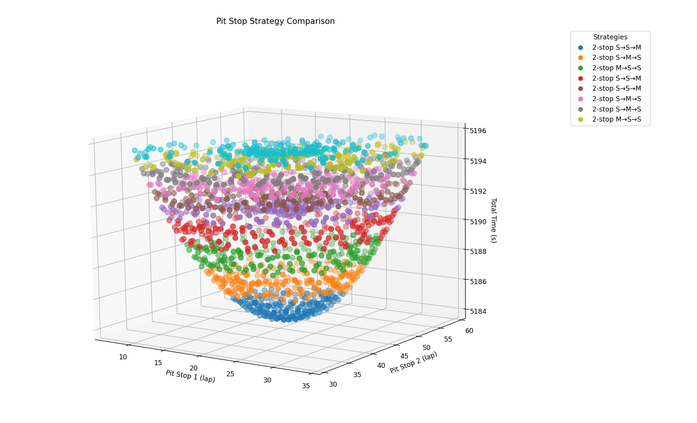
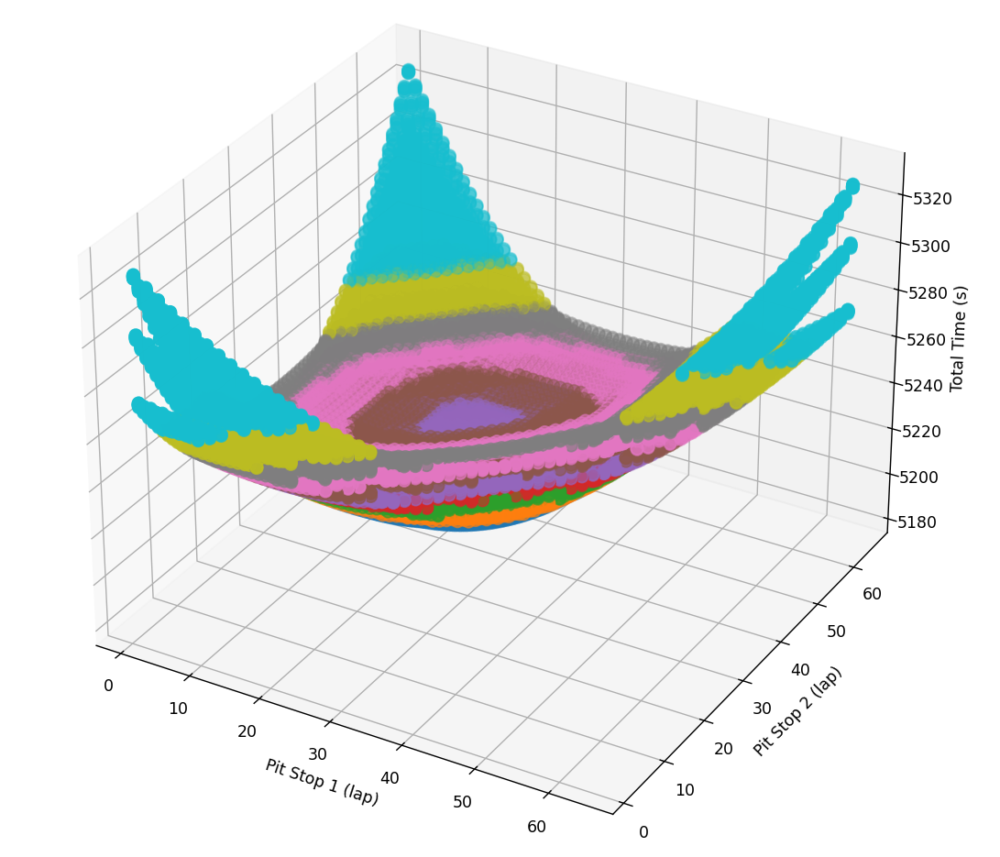

# F1 Pit Stop Strategy Simulator 🏎️⛽

This repository contains a **Formula 1 pit stop strategy simulator**, capable of generating and comparing different combinations of tire compounds and pit stops for a race. It helps analyze which strategy is fastest based on the track, tires, and random events such as Safety Cars (SC) or Virtual Safety Cars (VSC).

---

## Features

- Automatically generates all possible strategies up to a maximum number of pit stops.
- Simulates a race considering:
  - Tire degradation
  - Fuel load effect
  - Random events (SC and VSC)
  - Pit stop time adjustments depending on events
- Compares strategies and calculates total race time.
- Exports results to CSV and visualizes lap times.

---


## Installation

It is recommended to create a virtual environment with Python 3.10+:

```bash
python -m venv venv
source venv/bin/activate   # Linux/macOS
venv\Scripts\activate      # Windows
pip install -r requirements.txt
```

## Example Output
The simulator produces a CSV with the results, including:

Strategy: sequence of compounds used per stint.

Total: total race time.

Pit in Laps: laps where pit stops occurred.
Example: 
| Strategy     | Total     | Pit in Laps |
| ------------ | --------- | ----------- |
| 2-stop S→M→S | 86:24.937 | \[19, 44]   |

## 3D Visualization of Pit Stop Strategies

The simulator can generate **3D plots** to analyze the race dynamics:

- **X-axis:** Lap number  
- **Y-axis:** Lap time (seconds)  
- **Z-axis / Color / Depth:** Tire compound or stint index  

This allows you to see how lap times evolve over the race and **where pit stops improve lap performance**. 

We can visualize the results of the strategy simulations with images. The curves show lap times for all generated strategies. The lower points in the curve correspond to laps immediately after pit stops.

### Example: 2,000 Strategies Simulated

<p align="center">
  
</p>

### Example: 50,000 Strategies Simulated

<p align="center">
  
</p>


